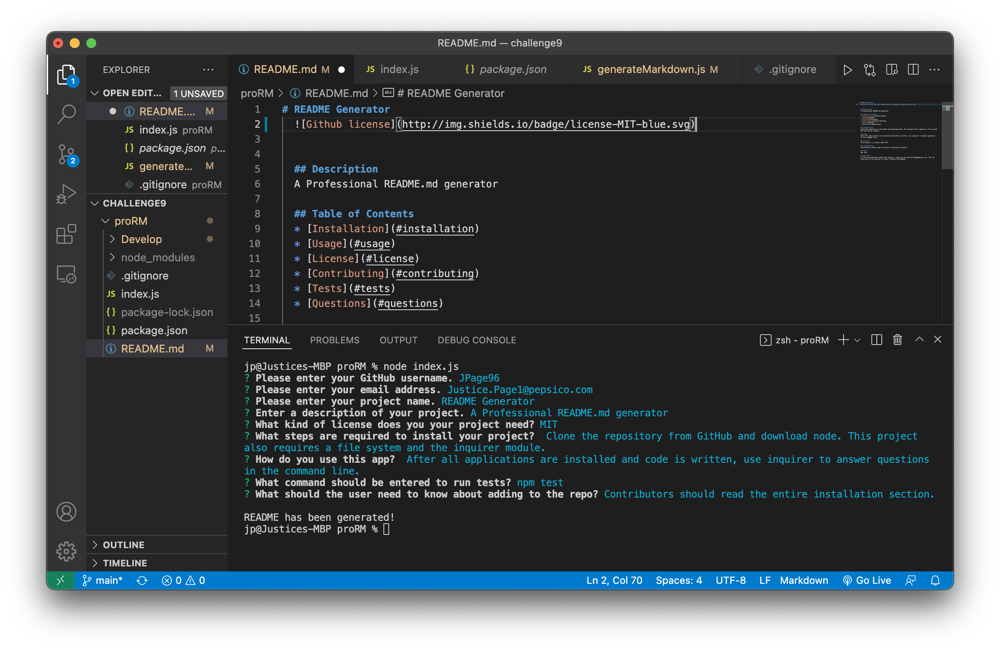

# README Generator
  

  
  ## Description 
  A Professional README.md generator

  ## Table of Contents
  * [Installation](#installation)
  * [Usage](#usage)
  * [License](#license)
  * [Contributing](#contributing)
  * [Tests](#tests)
  * [Questions](#questions)
  
  ## Installation 
  Clone the repository from GitHub and download node. This project also requires a file system and the iquirer module.

  ## Usage 
  After all applications are installed and code is written, use inquirer to answer questions in the command line.

  ## License 
  This project is license under MIT

  ## Contributing 
  Contributors should read the entire installation section.

  ## Tests
  npm test

  ## Questions
  If you have questions about this project, reach out at Justice.Page1@pepsico.com. You can view more of my projects at https://github.com/JPage96.

  ## Screenshot
  

  ## Video
 